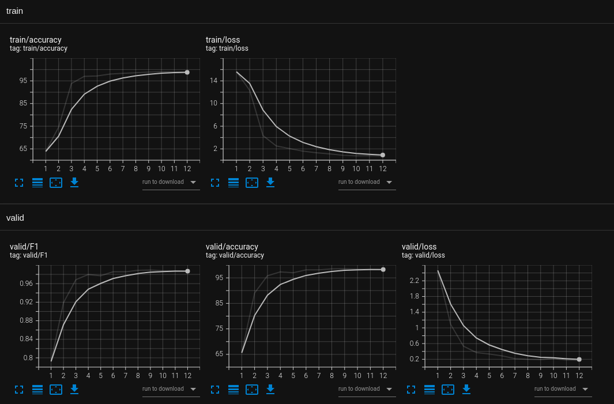

# Image Sequence Classification 


## Create train and validation dataset 
```bash
python create_dataset.py --data-dir=data
```

## Train a model  
```bash
python train.py --data-dir=data --model-dir=trained_models
```

## Inference
```bash
python play.py --model-path=trained_models/train_06-27-2022_12:14:21.pt
```

## TensorBoard for graph visualization
```bash
tensorboard --logdir ./runs
```

# Report
The network is trained end2end, it uses a CNN model to embed each image into a feature vector state,
and GRU for sequence processing, using recurrent network allows processing of sequences of arbitrary length. The model is train for 12 epochs as it starts to over-fit the training data if it's trained longer.
I use loss, accuracy, and f1 score (dataset is unbalanced, there are twice as many positive examples compared to negative) as performance metrics. Model achieve accuracy: 99.50 and F1 score 0.996115 on validation dataset.
During inference sequences longer than 30 images are used.


